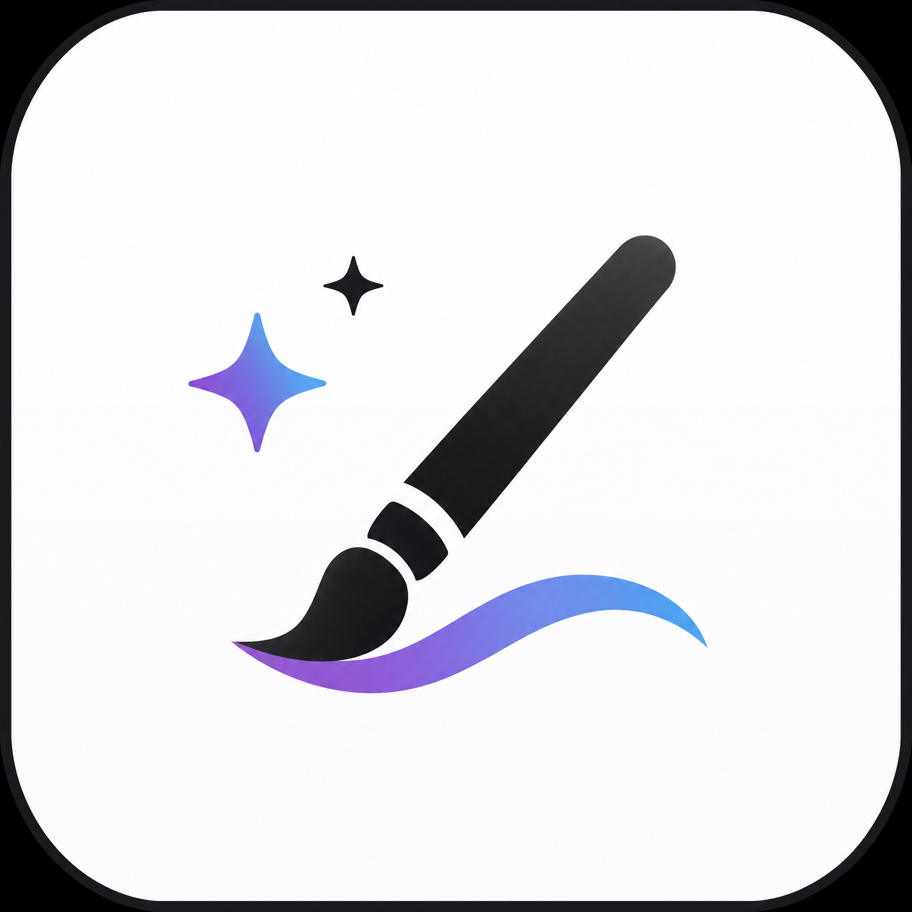

  

# XAI · Image Studio

桌面主线统一为 **React + TypeScript + Wails + Go**。工作室是唯一创作入口，支持 API Key 生图、生视频与节点式无限画布；「经典编辑」入口已移除。使用步骤见 [Studio 文档](./docs/studio-v2.md)，sub2api 配置见 [接入指南](./docs/sub2api.md)。独立 Gio 客户端已下线，Go 后端与共享模块继续保留。

> BGMYE/XAI 中的开源图像生成 / 编辑客户端 · Wails（Go + React/TS）桌面端 ·
> 支持 Responses API 的 SSE / WebSocket mode 与标准 Images API

Image Studio 面向 OpenAI 兼容图像上游，重点解决长时间图像推理在 Cloudflare / Nginx 后面容易遇到的 524/504 断连问题。Responses API 模式支持 `HTTP SSE` 与 `WebSocket mode` 两种传输；Images API 模式则兼容标准 `/v1/images/generations` 与 `/v1/images/edits`。

项目不内置默认上游，也不提供公共 `BaseURL` 或 API Key。首次启动需要填写你有权使用的 `BaseURL`、API Key、接口协议与图像模型，Responses 另需文本模型；生成请求和输入素材会发往该外部服务，其可用性、计费、隐私和模型能力由服务提供方决定。

## 当前支持与边界

- **Windows**：Wails 桌面端依赖 WebView2。仓库可构建 x64 / ARM64 产物，但 Release 或 Actions 中是否存在对应安装包、是否经过 Authenticode 签名，以 [BGMYE/XAI Releases](https://github.com/BGMYE/XAI/releases) 的实际资产为准；未签名构建可能被 SmartScreen 或 Smart App Control 拦截。
- **macOS**：Wails 桌面端可构建 universal app。未使用有效 Apple Developer ID 签名并完成公证的包，可能被 Gatekeeper 阻止；仓库中的本地自签不等于 Apple 公证。
- **外部上游**：应用只是客户端，不附送模型额度或代理服务。`BaseURL` 必须与所选 Responses API / Images API 形态兼容，API Key 也必须具备相应模型权限；连接成功不代表每个扩展参数都被上游实现。
- **无限画布**：桌面端使用持久化世界坐标保存图片与视频节点，支持平移、以指针为中心缩放、节点选择/拖拽/删除、适配全部，以及按工作区保存节点与视口。可导入参考图并将成品用于下一轮编辑；旧版 Konva 标注与目录批处理不再提供经典入口。视频节点可直接预览。
- **外部视频**：上游配置可填写独立且显式的 `videoModelID`。桌面端通过当前 profile 的 `BaseURL + API Key + videoModelID` 提交 `/v1/videos`，轮询 `/v1/videos/{id}`，接受 URL 或 `b64_json` 结果，并把结果追加到无限画布。应用不会把视频模型静默替换成图像模型，也不内置本地视频模型、剪辑或转码。
- **配置能力**：提供 sub2api 预设、接口选择 TIPS、按模型和协议确认的能力记录，以及 Responses 精确执行 / 创作辅助模式。保存设置和模型发现不会暗中生成收费图片。

当前没有独立部署的在线 Web 版。仓库里的浏览器预览主要用于前端调试和 target platform 预览，不等同于可直接对外提供服务的 SaaS Web 端。

**配套项目 [Image-Prompts](https://prompts.sorry.ink/) 提供提示词浏览与一键导入能力，支持把网页上的提示词直接送入 Image Studio 桌面端。相关说明见 [docs/prompt-import.md](./docs/prompt-import.md)。**

## 快速上手

1. 安装应用
   - 稳定版本：到 [BGMYE/XAI Releases](https://github.com/BGMYE/XAI/releases) 查看当前已发布资产。
   - 抢先体验当前分支的最新改动：到 [BGMYE/XAI Actions · release.yml](https://github.com/BGMYE/XAI/actions/workflows/release.yml) 查看最近一次成功构建的 artifact。
     Windows 上这类 CI `exe` 如果没有签名，可能会被 Win11 Smart App Control / SmartScreen 拦截，因此只建议用于内部测试。
   - 各平台安装包区别、命名规则和选择建议见 [docs/packages.md](./docs/packages.md)。
2. 打开「设置 → 添加上游」，填写 Base URL、API Key 和精确模型 ID；使用 sub2api 时选对应预设。
3. 按接口旁的 TIPS 选择协议：直接生图和编辑优先验证 Images，需要文本模型编排时验证 Responses；两者都可能支持流式，协议不代表画质档位。
4. 选择创作描述、已确认支持的参数、参考图和结果画布。
5. 明确点击「生成」；专业模式也可在节点画布运行工作流。

更完整的配置与参数策略说明见 [docs/usage.md](./docs/usage.md)。

## 遇到问题先排查

很多“生成失败 / 保存失败 / 模型不可用”并不是 Image Studio 自身的缺陷，而是上游配置、Key 权限、网关超时、模型能力或兼容实现差异导致的。

提 Issue 前建议先做这几步:

1. 在当前 profile 里点一次「测试连接」，检查地址和基础鉴权、发现模型列表；列表不证明实际生图或编辑权限。
2. 对照 [docs/troubleshooting.md](./docs/troubleshooting.md) 自查 `524/504`、`401/403`、`model not found`、多参考图/蒙版不生效等常见非软件问题。
3. 从历史详情或 raw 响应里确认真实 HTTP 状态码和上游报错，不要只看页面 toast。
4. 如果同样的 `BASE_URL + Key + 模型 ID` 在 curl、Postman 或上游自带调试页里也失败，优先联系你的上游服务商，而不是提交本仓库 Issue。
5. 仍然怀疑是软件问题时，再按 [docs/feedback.md](./docs/feedback.md) 准备最少复现信息提交 Issue。

## 文档导航

| 内容 | 文档 |
|---|---|
| 应用展示、界面截图、能力概览 | [docs/showcase.md](./docs/showcase.md) |
| 安装包下载、平台差异、产物选择 | [docs/packages.md](./docs/packages.md) |
| 功能清单、平台能力、快捷键 | [docs/features.md](./docs/features.md) |
| sub2api 预设、协议 TIPS 与真实部署验收 | [docs/sub2api.md](./docs/sub2api.md) |
| 当前 issue 处理进展与待验证项 | [docs/issue-progress.md](./docs/issue-progress.md) |
| 可直接复用的 issue 关单评论模板 | [docs/issue-close-comments.md](./docs/issue-close-comments.md) |
| 源码构建、验证脚本、CI 产物链路 | [docs/build.md](./docs/build.md) |
| 真机 / 真实上游手工验证矩阵 | [docs/manual-verification.md](./docs/manual-verification.md) |
| 首次配置、API 形态选择、参数策略 | [docs/usage.md](./docs/usage.md) |
| 配套项目 Image-Prompts 与提示词导入 | [docs/prompt-import.md](./docs/prompt-import.md) |
| 提 Issue 前自查、数据存储位置、524/504、模型权限、字段兼容问题 | [docs/troubleshooting.md](./docs/troubleshooting.md) |
| 仓库结构、前端分层、内核 / Worker 关系 | [docs/project-structure.md](./docs/project-structure.md) |
| 精确执行与创作辅助提示词模式 | [docs/no-prompt-revision/README.md](./docs/no-prompt-revision/README.md) |
| 提示词中心与桌面精简 | [docs/prompt-center.md](./docs/prompt-center.md) |
| 桌面架构与客户端精简 | [docs/desktop-architecture.md](./docs/desktop-architecture.md) |
| 跨平台内核计划与验证背景 | [docs/cross-platform-kernel-plan.md](./docs/cross-platform-kernel-plan.md) |
| 反馈渠道、问题提交、QQ群讨论 | [docs/feedback.md](./docs/feedback.md) |

## License

[GNU AGPL v3.0](./LICENSE) © 2026

这意味着基于本项目进行修改后再分发，或将修改版作为网络服务提供给他人使用时，都需要按同一许可证公开对应源码。

## 致谢

-  [**linux.do**](https://linux.do/) —— 感谢 L 站及其社区为项目开发与交流提供的支持与启发。

### 赞助商

  

